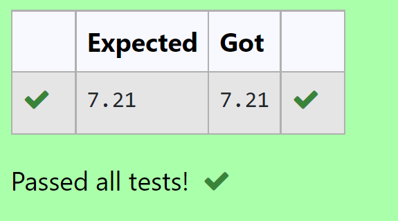

# DISTANCE-BETWEEN-TWO-POINTS

## AIM:
To write a python program to find the distance two 2 points

## ALGORITHM:
### Step 1:
Import math function.
### Step 2: 
Assign the values of point 1 and point 2 whose distance is to be calculated.
### Step 3: 
Substitute the values in the distance formula  

### Step 4: 
Print the coding to get the answer.
### Step 5: 
End the program.

## PROGRAM:
```
#Program to calculate the distance between two points.
#Developed by: Aashima Nazreen Sayeed S
#RegisterNumber: 21500368
import math
a = [10,6]
b = [4,2]
value = math.sqrt(((b[0]-a[0])**2)+((b[1]-a[1])**2))
print("{:.2f}".format(value))
```
  
## OUTPUT:



## RESULT:
Thus, the distance between two points is calculated.
